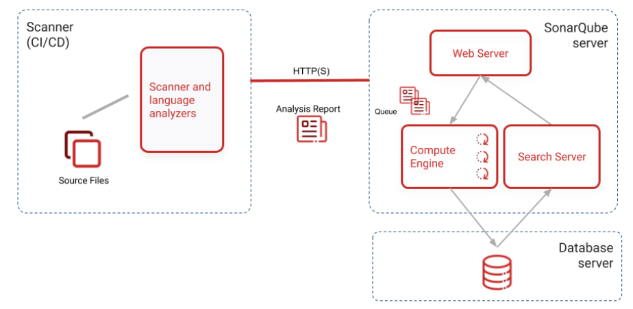
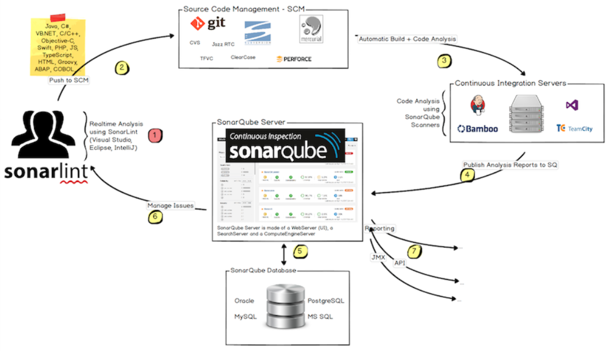

# SonarQube介绍

> 来源: CI/CD
> 创建时间: 2023-06-27T09:26:48+08:00
> 更新时间: 2026-01-17T19:20:27.773625+08:00
> 阅读量: 1966 | 点赞: 0

---

# 简介
SonarQube 是一个用于代码质量管理的开源平台，用于管理源代码的质量。同时 SonarQube 还对大量的持续集成工具提供了接口支持，可以很方便地在持续集成中使用 SonarQube。此外， SonarQube 的插件还可以对 Java 以外的其他编程语言提供支持，对国际化以及报告文档化也有良好的支持。

# 使用范围
通过插件形式，可以支持包括 Java,C#,C/C++、PL/SQL、Cobol、JavaScrip、Groovy、Ruby 等二十五种编程语言的代码质量管理与检测，针对不同的编程语言其所提供的分析方式也有所不同：对于所有支持的编程语言，SonarQube 都提供源了代码的静态分析功能；对于某些特定的编程语言，SonarQube 提供了对编译后代码的静态分析功能。

SonarQube 支持多种客户端集成方式，包括但不限于 Scanner 客户端、Ant、Gradle、Maven、Jenkins、IDEA 插件等。比较常用的为 Gradle 和 Maven。

# 组成

# 与CICD集成

开发人员在他们的ide中使用SonarLint运行分析本地代码。

开发人员将他们的代码提交到代码管理平台中（SVN，GIT等）

持续集成工具自动触发构建，调用SonarScanner对项目代码进行扫描分析

分析报告发送到SonarQube Server中进行加工

SonarQube Server 加工并且保存分析报告到SonarQube Database中，通过UI显示分析报告

