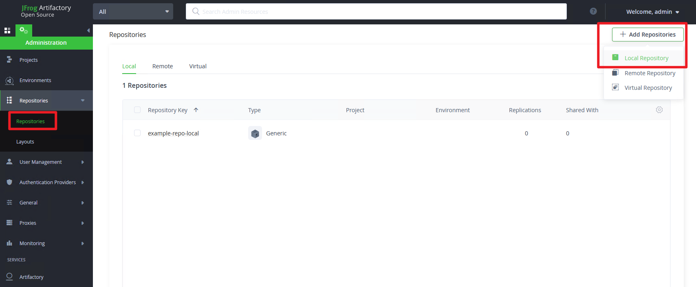
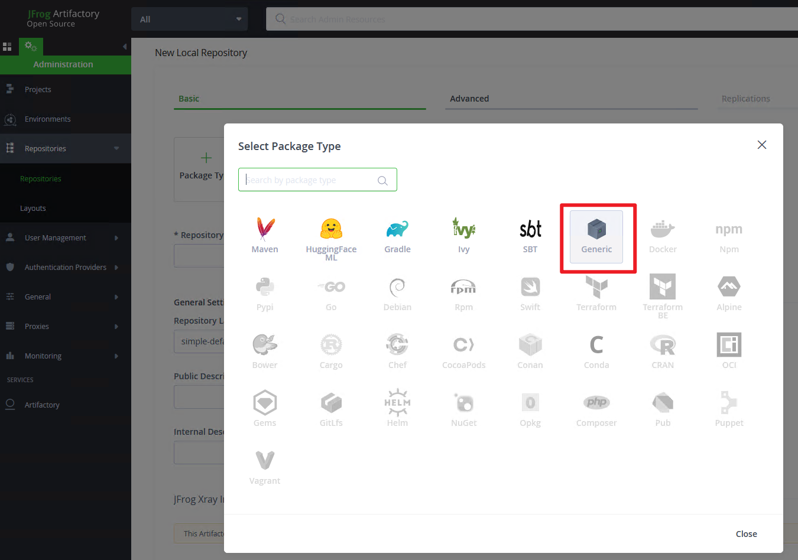
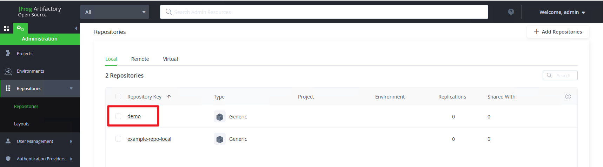
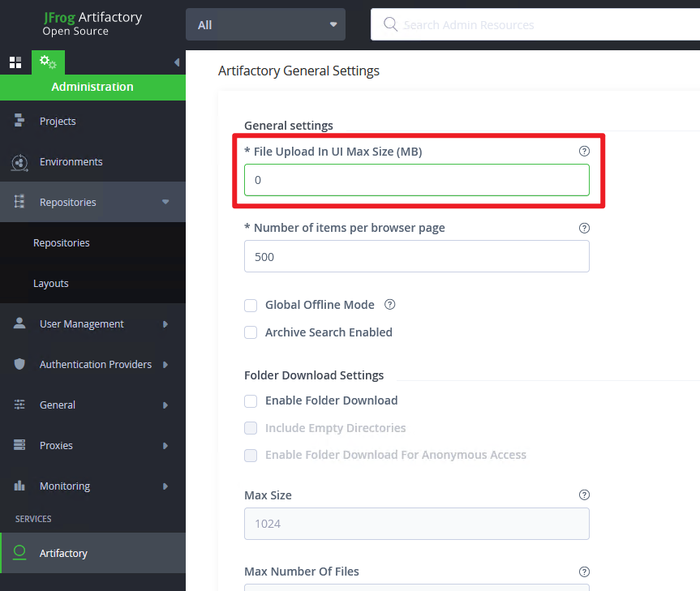
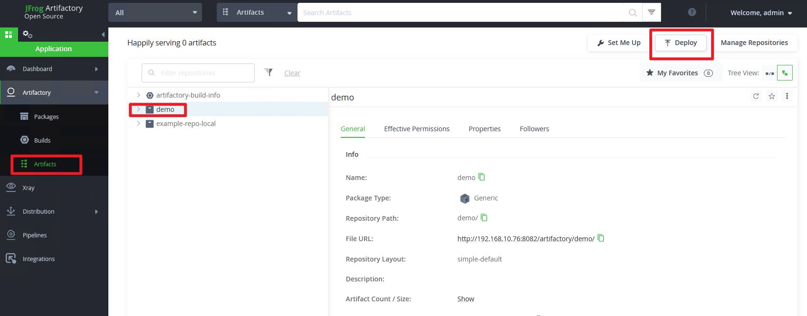
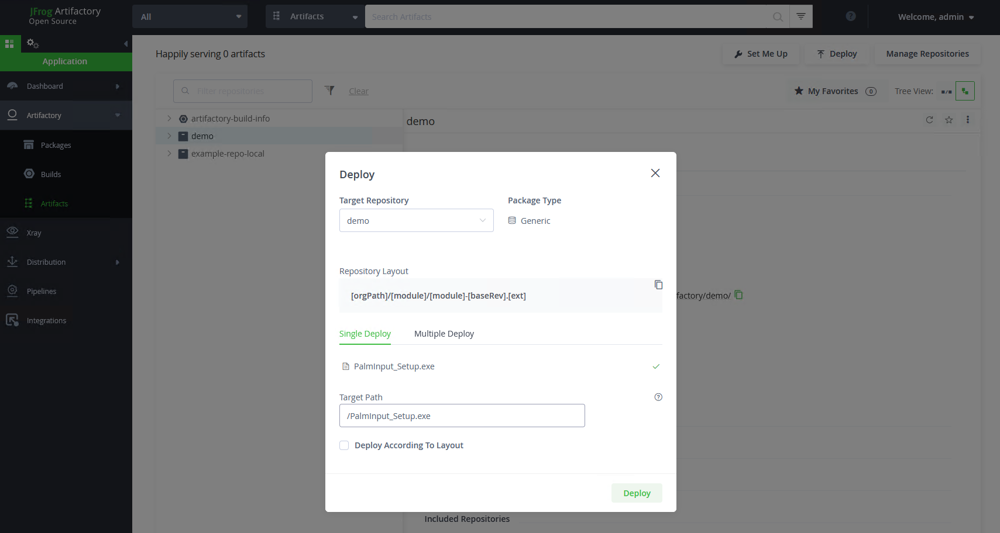
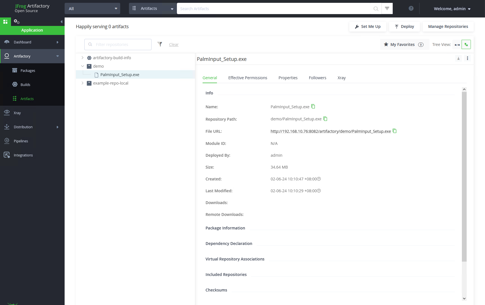
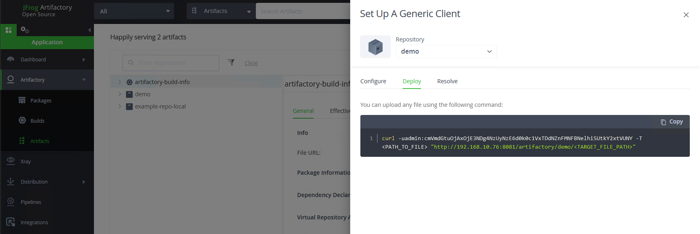
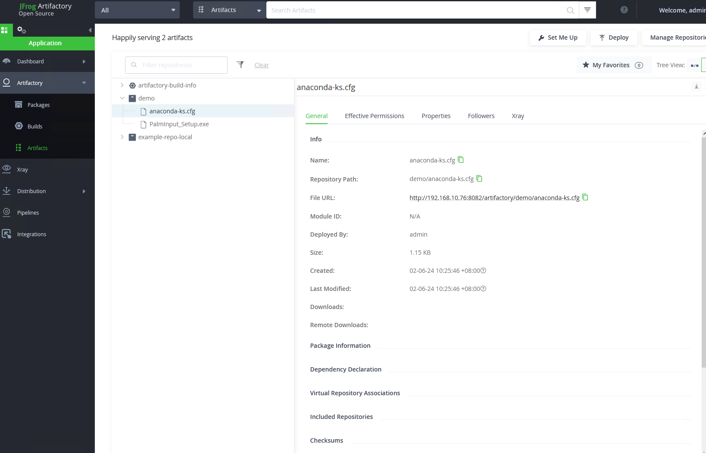

# Artifactory使用

> 来源: CI/CD
> 创建时间: 2024-06-02T09:55:41+08:00
> 更新时间: 2026-01-17T19:20:29.957455+08:00
> 阅读量: 885 | 点赞: 0

---

# 新建仓库
## 新建本地仓库


## 选择仓库类型


## 填写仓库信息


## 查看仓库信息


## 修改文件大小限制
<font style="color:rgb(77, 77, 77);">认是限制上传文件大小为100MB，我们把它改成0，即不限制大小</font>



# 上传制品到Artifactory
## 通过web页面上传
选择上传的仓库



选择文件



查看文件信息



## 通过API上传
获取api上传命令



上传文件测试

```bash
[root@client2 ~]# ls
anaconda-ks.cfg
[root@client2 ~]# curl -X PUT -u admin:YOUR_ACCESS_TOKEN  -T  anaconda-ks.cfg  "http://192.168.10.76:8082/artifactory/demo/anaconda-ks.cfg"
{
  "repo" : "demo",
  "path" : "/anaconda-ks.cfg",
  "created" : "2024-06-02T10:25:46.892+08:00",
  "createdBy" : "admin",
  "downloadUri" : "http://192.168.10.76:8082/artifactory/demo/anaconda-ks.cfg",
  "mimeType" : "application/octet-stream",
  "size" : "1174",
  "checksums" : {
    "sha1" : "15bce48ca41a1e4841e5a1c76761a61970658627",
    "md5" : "f86bac0477b416f1cc582562c3495ede",
    "sha256" : "34819659c8e124ed029db6a40c80e9b864465f25cc77807de459907cbecec756"
  },
  "originalChecksums" : {
    "sha256" : "34819659c8e124ed029db6a40c80e9b864465f25cc77807de459907cbecec756"
  },
  "uri" : "http://192.168.10.76:8082/artifactory/demo/anaconda-ks.cfg"
  }
```

查看仓库文件信息




