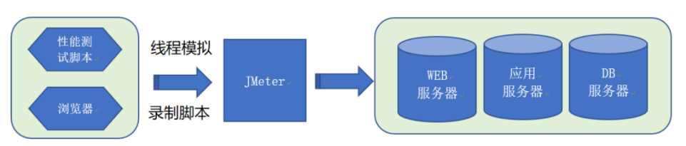
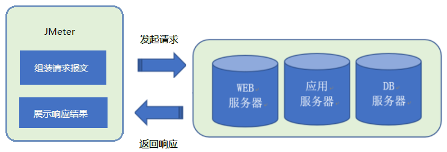

# Jmeter介绍

> 来源: CI/CD
> 创建时间: 2024-06-13T10:06:53+08:00
> 更新时间: 2026-01-17T19:20:31.235885+08:00
> 阅读量: 983 | 点赞: 0

---

Apache JMeter 是一款开源的负载测试和性能测试工具，广泛应用于对各种服务的性能评估，尤其是对Web应用和API的测试。

# 主要功能
1. **性能测试**：评估服务器、数据库、Web应用等在不同负载条件下的性能表现。
2. **压力测试**：模拟大量并发用户访问，测试系统的稳定性和最大承载能力。
3. **功能测试**：验证系统的功能是否按照预期工作。
4. **分布式测试**：支持分布式测试，可以通过多台机器模拟大规模并发用户。
5. **脚本录制**：内置录制工具，可以通过代理方式记录用户操作并生成测试脚本。

# 支持的协议
JMeter支持多种协议，包括但不限于：

+ HTTP、HTTPS
+ SOAP / REST Web服务
+ FTP
+ JDBC (数据库连接)
+ LDAP
+ JMS (Java消息服务)
+ SMTP、POP3、IMAP (邮件协议)

# Jmeter原理
Jmeter不仅可以作为性能测试工具，还可以作为接口测试工具。作为不同类型的工具，Jmeter的原理也有所不同，具体如下：

## 作为性能测试工具

Jmeter通过线程组驱动多个线程的方式运行，来模拟真实用户对Web服务器的访问压力。实现过程如下图所示

Jmeter作为Web服务器和浏览器之间的代理网关，能够录制浏览器的请求、响应Web服务器和生成测试脚本。在测试脚本的基础上，Jmeter通过线程组模拟真实用户的访问。

## 作为接口测试工
Jmeter向服务器提交请求，从服务器取回请求返回的响应结果，实现过程如下图所示：

作为发起请求的客户端，Jmeter是组装请求报文结构的容器，例如：请求行、请求头、请求数据等，并可将响应结果进行可视化展示。

对于接口的复杂逻辑，Jmeter有丰富的元件进行支持，如前/后置处理、响应断言、也可以自行开发插件。

