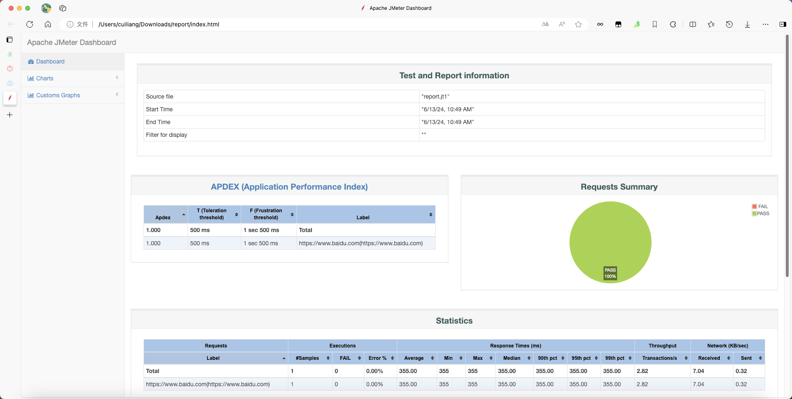

# Jmeter使用

> 来源: CI/CD
> 创建时间: 2024-06-13T10:29:07+08:00
> 更新时间: 2026-01-17T19:20:31.674215+08:00
> 阅读量: 816 | 点赞: 0

---

# 创建自动化测试脚本
推荐使用apifox工具创建自动化测试脚本，并导入jmeter进行测试，具体可参考文档：

[https://apifox.com/help/automated-testing/test-scenarios/creating-test-case](https://apifox.com/help/automated-testing/test-scenarios/creating-test-case)

# 本地执行自动化测试
将apifox创建的自动化测试脚本导出为demo.jmx文件，执行以下命令：

-n：非GUI模式运行jmeter

-t：自动化测试脚本路径

-l：指定测试结果保存文件为jtl文件格式

-e：测试完成后，生成测试报告

-o：指定测试报告存放的路径

-Jjemter.save.saveservice.output_format=csv：测试结果格式化为csv

```bash
[root@jmeter ~]# jmeter -n -t /root/demo.jmx -l report.jt1 -e -o report -Jjemter.save.saveservice.output_format=csv
WARN StatusConsoleListener The use of package scanning to locate plugins is deprecated and will be removed in a future release
WARN StatusConsoleListener The use of package scanning to locate plugins is deprecated and will be removed in a future release
WARN StatusConsoleListener The use of package scanning to locate plugins is deprecated and will be removed in a future release
WARN StatusConsoleListener The use of package scanning to locate plugins is deprecated and will be removed in a future release
Creating summariser <summary>
Created the tree successfully using /root/demo.jmx
Starting standalone test @ 2024 Jun 13 10:49:14 CST (1718246954236)
Waiting for possible Shutdown/StopTestNow/HeapDump/ThreadDump message on port 4445
summary =      1 in 00:00:00 =    2.0/s Avg:   355 Min:   355 Max:   355 Err:     0 (0.00%)
Tidying up ...    @ 2024 Jun 13 10:49:14 CST (1718246954825)
... end of run
```

# 远程执行自动化测试
## 服务端启动
添加服务脚本

```bash
[root@jmeter ~]# vim /etc/systemd/system/syst	.service
[Unit]
Description=Apache JMeter Server
After=network.target

[Service]
Type=simple
ExecStart=/opt/jmeter/bin/jmeter-server -Dserver.rmi.ssl.disable=true
Restart=always

[Install]
WantedBy=multi-user.target
```

启动服务

```bash
[root@jmeter ~]# systemctl daemon-reload
[root@jmeter ~]# systemctl start jmeter-server
[root@jmeter ~]# systemctl status jmeter-server
```

## 客户端调用
使用docker客户端调用测试

```bash
[root@jmeter ~]# mkdir -p /opt/docker/jmeter
# 复制自动化测试脚本
[root@jmeter ~]# cd /opt/docker/jmeter/
[root@jmeter jmeter]# cp /root/demo.jmx .
# 启动容器
[root@jmeter jmeter]# docker run -it -v /opt/docker/jmeter:/data harbor.local.com/cicd/jmeter:5.6.3 sh
/ # cd /data/
/data # ls
demo.jmx
/data # jmeter -n -t /data/demo.jmx -R 192.168.10.77:1099 -l report.jt1 -e -o /data/report -Jjemter.save.saveservice.output_format=csv -Dserver.rmi.ssl.disable=true
WARN StatusConsoleListener The use of package scanning to locate plugins is deprecated and will be removed in a future release
WARN StatusConsoleListener The use of package scanning to locate plugins is deprecated and will be removed in a future release
WARN StatusConsoleListener The use of package scanning to locate plugins is deprecated and will be removed in a future release
WARN StatusConsoleListener The use of package scanning to locate plugins is deprecated and will be removed in a future release
Creating summariser <summary>
Created the tree successfully using /data/demo.jmx
Configuring remote engine: 192.168.10.77:1099
Starting distributed test with remote engines: [192.168.10.77:1099] @ 2024 Jun 13 05:19:47 GMT (1718255987943)
Remote engines have been started:[192.168.10.77:1099]
Waiting for possible Shutdown/StopTestNow/HeapDump/ThreadDump message on port 4445
summary =      1 in 00:00:00 =    7.2/s Avg:    84 Min:    84 Max:    84 Err:     0 (0.00%)
Tidying up remote @ 2024 Jun 13 05:19:48 GMT (1718255988283)
... end of run
```

# 查看测试报告
```bash
[root@jmeter ~]# ls
anaconda-ks.cfg  apache-jmeter-5.6.3.tgz  demo.jmx  jmeter.log  report  report.jt1
[root@jmeter ~]# cd report/
[root@jmeter report]# ls
content  index.html  sbadmin2-1.0.7  statistics.json
```

打开index.html文件，内容如下：




