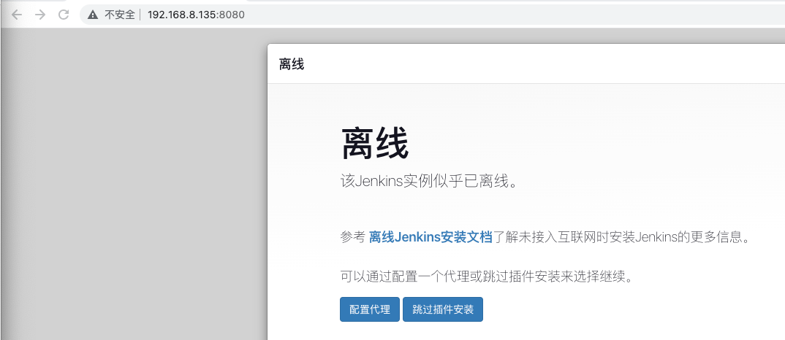

# jenkins部署(rpm)

> 来源: CI/CD
> 创建时间: 2020-10-29T09:56:13+08:00
> 更新时间: 2026-01-17T19:20:31.906464+08:00
> 阅读量: 3560 | 点赞: 0

---

# 安装JDK
每个版本的jenkins依赖的jdk版本不一致，可以参考页面[https://pkg.jenkins.io/redhat-stable/](https://pkg.jenkins.io/redhat-stable/)，根据要安装的jenkins版本，安装合适的jdk。例如本次安装的jenkins版本为2.361.1，依赖的jdk版本为java11或者java17

## yum方式安装jdk(推荐)
```bash
# 安装
[root@jenkins ~]# yum install java-11-openjdk
# 验证
[root@jenkins jenkins]# java -version
openjdk version "11.0.19" 2023-04-18 LTS
OpenJDK Runtime Environment (Red_Hat-11.0.19.0.7-2) (build 11.0.19+7-LTS)
OpenJDK 64-Bit Server VM (Red_Hat-11.0.19.0.7-2) (build 11.0.19+7-LTS, mixed mode, sharing)
```

## 二进制安装jdk
下载地址：[https://www.openlogic.com/openjdk-downloads](https://www.openlogic.com/openjdk-downloads)

```bash
[root@jenkins ~]# wget https://builds.openlogic.com/downloadJDK/openlogic-openjdk/17.0.7+7/openlogic-openjdk-17.0.7+7-linux-x64.tar.gz
[root@jenkins ~]# mkdir /usr/local/jdk
[root@jenkins ~]# tar -zxf openlogic-openjdk-17.0.7+7-linux-x64.tar.gz -C /usr/local/jdk
[root@jenkins ~]# cd /usr/local/jdk/openlogic-openjdk-17.0.7+7-linux-x64/
[root@jenkins openlogic-openjdk-17.0.7+7-linux-x64]# ls
bin  conf  demo  include  jmods  legal  lib  man  release
# 添加环境变量
[root@jenkins ~]# vim /etc/profile
export JAVA_HOME=/usr/local/jdk/openlogic-openjdk-17.0.7+7-linux-x64
export CLASSPATH=.:${JAVA_HOME}/jre/lib/rt.jar:${JAVA_HOME}/lib/dt.jar:${JAVA_HOME}/lib/tools.jar
export PATH=$PATH:${JAVA_HOME}/bin
[root@jenkins ~]# source /etc/profile
[root@jenkins openlogic-openjdk-17.0.7+7-linux-x64]# java -version
openjdk version "17.0.7" 2023-04-18
OpenJDK Runtime Environment OpenLogic-OpenJDK (build 17.0.7+7-adhoc.root.jdk17u)
OpenJDK 64-Bit Server VM OpenLogic-OpenJDK (build 17.0.7+7-adhoc.root.jdk17u, mixed mode, sharing)
# 创建软连接
[root@jenkins ~]# ln -s /usr/local/jdk/openlogic-openjdk-17.0.7+7-linux-x64/bin/java /usr/bin/java
```

# 安装jenkins
## 在线安装
+ 添加Jenkins库到yum库，Jenkins将从这里下载安装。

```bash
wget -O /etc/yum.repos.d/jenkins.repo https://pkg.jenkins.io/redhat-stable/jenkins.repo
rpm --import https://pkg.jenkins.io/redhat-stable/jenkins.io-2023.key
yum install jenkins
```

## 离线安装
+ 如果因为网络问题导致不能安装官网离线包，可以下载阿里巴巴的jenkins离线包[https://mirrors.aliyun.com/jenkins/](https://mirrors.aliyun.com/jenkins/)

```bash
wget https://mirrors.aliyun.com/jenkins/redhat-stable/jenkins-2.440.2-1.1.noarch.rpm
rpm -ivh jenkins-2.440.2-1.1.noarch.rpm
```

## 修改配置
+ 配置jenkis的端口 (此端口不冲突可以不修改)

`vi /etc/sysconfig/jenkins` 

+ 找到修改端口号：

`JENKINS_PORT="8080"`

# 启动jenkins
## 启动服务
`systemctl start jenkins`

`systemctl enable jenkins`  

+ 安装成功后Jenkins将作为一个守护进程随系统启动
+ 系统会创建一个“jenkins”用户来允许这个服务，如果改变服务所有者，同时需要修改/var/log/jenkins, /var/lib/jenkins, 和/var/cache/jenkins的所有者
+ 启动的时候将从/etc/sysconfig/jenkins获取配置参数
+ 默认情况下，Jenkins运行在8080端口，在浏览器中直接访问该端进行服务配置
+ Jenkins的RPM仓库配置被加到/etc/yum.repos.d/jenkins.repo

## 访问jenkins 
+ 在浏览器中访问 http://主机ip:8080/

# 常见问题
1. 使用二进制安装jdk17后，启动jenkins报错日志如下：

```bash
2023-07-02 09:06:36.665+0000 [id=1]     SEVERE  hudson.util.BootFailure#publish: Failed to initialize Jenkins
java.lang.UnsatisfiedLinkError: /usr/local/jdk/openlogic-openjdk-17.0.7+7-linux-x64/lib/libfontmanager.so: libharfbuzz.so.0: cannot open shared object file: No such file or directory
```

问题原因：系统缺少libharfbuzz.so模块，解决办法：

```bash
dnf -y install harfbuzz
```

或者根据系统版本离线下载，下载地址：[https://pkgs.org/download/libharfbuzz.so.0()(64bit)](https://pkgs.org/download/libharfbuzz.so.0()(64bit))

2. jenkins提示离线



访问http://ip:8080/pluginManager/advanced，改为国内源，地址为[https://mirrors.huaweicloud.com/jenkins/updates/update-center.json](https://mirrors.huaweicloud.com/jenkins/updates/update-center.json)

之后重启jenkins即可。


