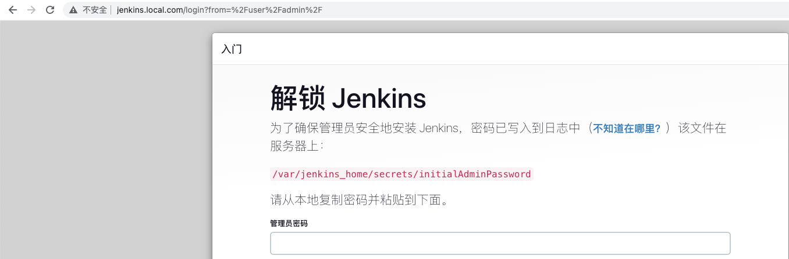

# jenkins部署(k8s)

> 来源: CI/CD
> 创建时间: 2023-06-26T16:56:53+08:00
> 更新时间: 2026-01-17T19:20:32.291217+08:00
> 阅读量: 3907 | 点赞: 1

---

# 创建资源
## rbac
```yaml
[root@tiaoban cicd]# cat > jenkins-rbac.yaml << EOF
apiVersion: v1
kind: ServiceAccount
metadata:
  name: jenkins
  namespace: cicd
---
apiVersion: rbac.authorization.k8s.io/v1
kind: ClusterRole
metadata:
  name: jenkins
rules:
  # 详细写对什么资源有什么操作可以用kubectl explain ClusterRole.rules，也可以授权访问所有k8s资源增删改查
  - apiGroups: [""]
    resources: ["*"]
    verbs: ["*"]
---
apiVersion: rbac.authorization.k8s.io/v1
kind: ClusterRoleBinding
metadata:
  name: jenkins
  namespace: cicd
roleRef:
  apiGroup: rbac.authorization.k8s.io
  kind: ClusterRole
  name: jenkins
subjects:
  - kind: ServiceAccount
    name: jenkins
    namespace: cicd
EOF
```

## pvc
```yaml
[root@tiaoban cicd]# cat > jenkins-pvc.yaml << EOF
apiVersion: v1
kind: PersistentVolumeClaim
metadata:
  name: jenkins-pvc
  namespace: cicd
spec:
  storageClassName: nfs-client
  accessModes:
    - ReadWriteOnce
  resources:
    requests:
      storage: 10Gi
EOF
```

## deployment
```yaml
[root@tiaoban cicd]# cat > jenkins-deployment.yaml << EOF
apiVersion: apps/v1
kind: Deployment
metadata:
  name: jenkins
  namespace: cicd
spec:
  selector:
    matchLabels:
      app: jenkins
  replicas: 1
  template:
    metadata:
      labels:
        app: jenkins
    spec:
      serviceAccountName: jenkins
      containers:
        - name: jenkins
          image: harbor.local.com/cicd/jenkins:2.455
          ports:
            - containerPort: 8080
              name: web
            - containerPort: 50000
              name: slave
          readinessProbe:
            tcpSocket:
              port: web
          livenessProbe:
            httpGet:
              path: /login
              port: web
            timeoutSeconds: 5
          startupProbe:
            httpGet:
              path: /login
              port: web
            failureThreshold: 20
            periodSeconds: 60
          resources:
            requests:
              memory: "512Mi"
              cpu: "500m"
            limits:
              memory: "8Gi"
              cpu: "4"
          volumeMounts:
            - name: data
              mountPath: /var/jenkins_home
      securityContext:
        runAsUser: 1000
        runAsGroup: 1000
        fsGroup: 1000
      volumes:
        - name: data
          persistentVolumeClaim:
            claimName: jenkins-pvc
EOF
```

## svc
```yaml
[root@tiaoban cicd]# cat > jenkins-svc.yaml << EOF
apiVersion: v1
kind: Service
metadata:
  name: jenkins
  namespace: cicd
spec:
  selector:
    app: jenkins
  ports:
    - port: 8080
      targetPort: web
      name: web
    - port: 50000
      targetPort: slave
      name: slave
EOF
```

## ingress
```yaml
[root@tiaoban cicd]# cat > jenkins-ingress.yaml << EOF
apiVersion: traefik.containo.us/v1alpha1
kind: IngressRoute
metadata:
  name: jenkins
  namespace: cicd
spec:
  entryPoints:
    - web
  routes:
    - match: Host(`jenkins.local.com`)
      kind: Rule
      services:
        - name: jenkins
          port: 8080
EOF
```

# 访问验证
## 查看资源状态
```bash
[root@tiaoban jenkins]# kubectl get all -n cicd
NAME                           READY   STATUS    RESTARTS   AGE
pod/jenkins-59dfbb6854-b4p8d   1/1     Running   0          86s

NAME                  TYPE        CLUSTER-IP       EXTERNAL-IP   PORT(S)              AGE
service/jenkins       ClusterIP   10.102.200.224   <none>        8080/TCP,50000/TCP   8s

NAME                      READY   UP-TO-DATE   AVAILABLE   AGE
deployment.apps/jenkins   1/1     1            1           87s

NAME                                 DESIRED   CURRENT   READY   AGE
replicaset.apps/jenkins-59dfbb6854   1         1         1       87s
```

## 访问验证
修改hosts记录，新增`192.168.10.10 jenkins.local.com`，访问即可。



查看初始密码

```bash
[root@tiaoban jenkins]# kubectl exec -it -n cicd jenkins-59dfbb6854-b4p8d -- bash
jenkins@jenkins-59dfbb6854-b4p8d:/$ cat /var/jenkins_home/secrets/initialAdminPassword
b3bad5eaf1ad4ebda9723f0003dcdf2a
```


