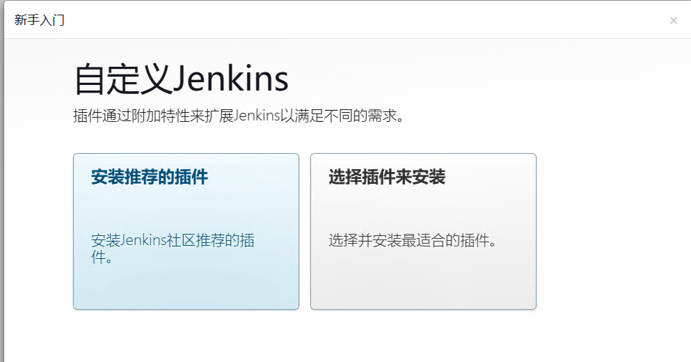
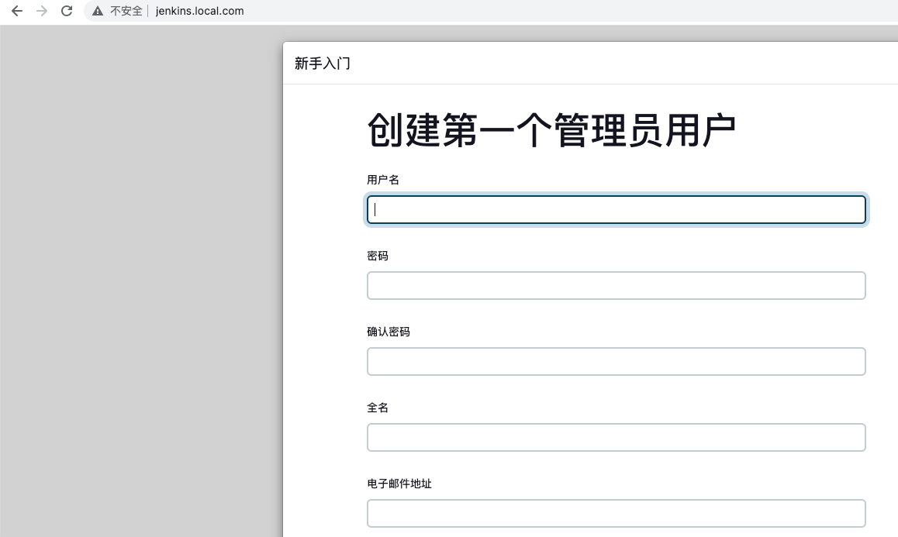
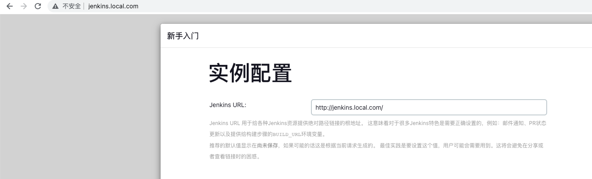
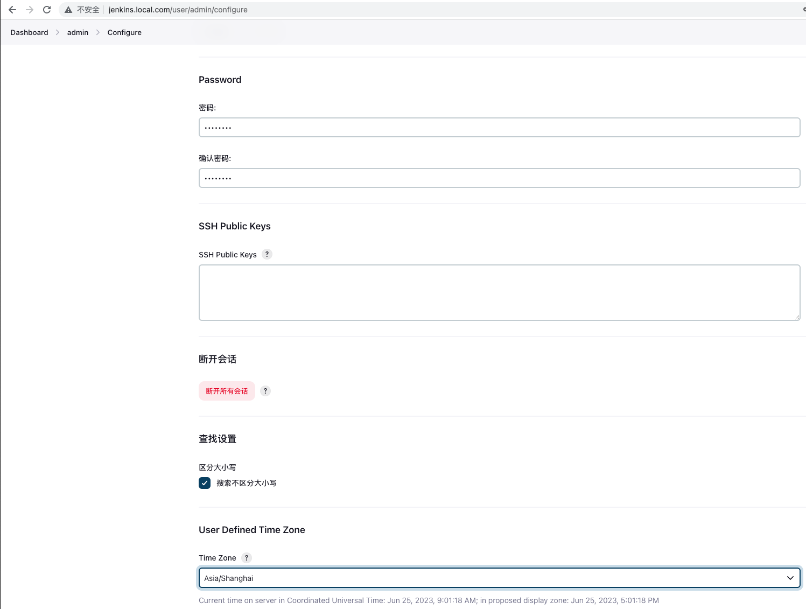
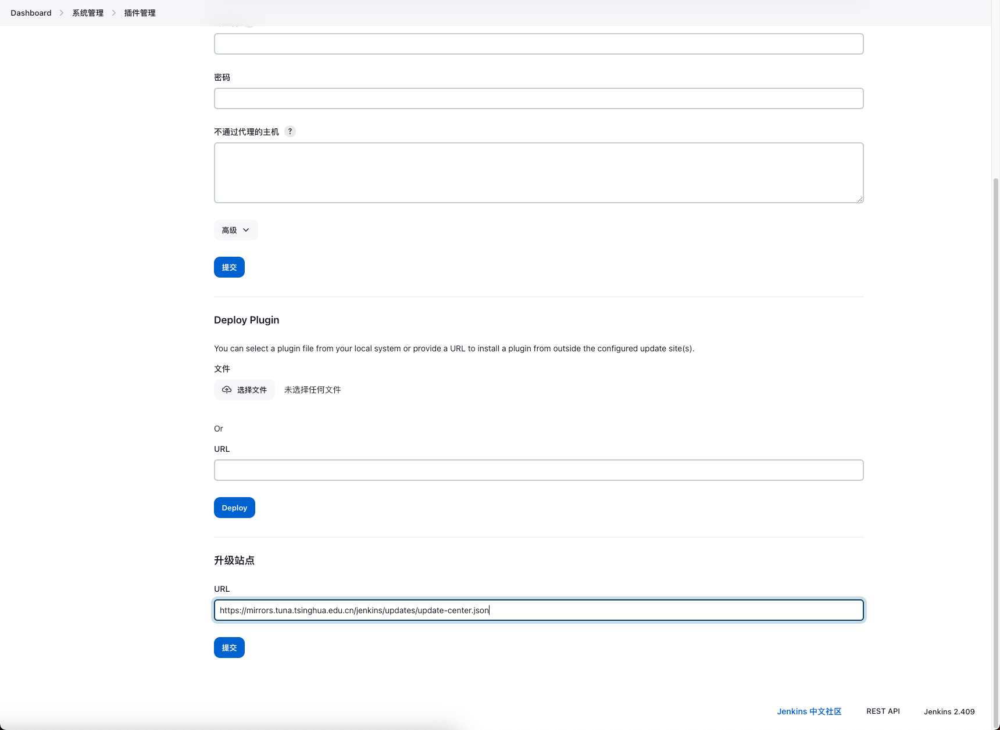

# jenkins基本设置

> 来源: CI/CD
> 创建时间: 2023-06-26T16:56:35+08:00
> 更新时间: 2026-01-17T19:20:32.511828+08:00
> 阅读量: 2880 | 点赞: 2

---

#  初始化设置
## 获取管理员密码
```bash
[root@tiaoban cicd]# cat /var/jenkins_home/secrets/initialAdminPassword
0ce189b4fad94ad487ec3263a061a3be
```

## 安装推荐的插件


## 创建管理员用户
也可以继续使用admin账号，在系统页面修改密码。



## 配置jenkins地址
如果是docker或者rpm包方式部署，填写jenkins域名即可，如果是k8s部署，可以填写svc形式。即http://jenkins.cicd.svc:8080/



# 使用配置
## 修改admin用户密码和时区
依次点击用户名——>Configure找到密码和时区设置



## 修改插件安装源
修改为国内插件源地址，提高插件下载速度

[https://mirrors.tuna.tsinghua.edu.cn/jenkins/updates/update-center.json](https://mirrors.tuna.tsinghua.edu.cn/jenkins/updates/update-center.json)



## 插件卸载
如果遇到插件异常导致jenkins系统无法使用，可以尝试卸载异常插件

```bash
# 停止jenkins服务
systemctl stop jenkins
# 删除插件目录下异常插件.jpi文件
rm -rf /var/jenkins_home/plugins/role-strategy.jpi
# 重启jenkins
systemctl start jenkins
```


